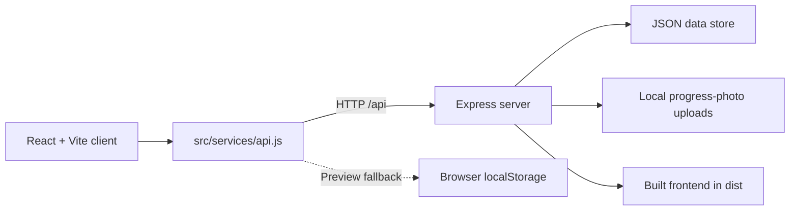

# ZID Fitness & Performance


[**Visit the live site**](https://zid-fitness-zone.onrender.com)

**A full-stack fitness club web application** with a public-facing member experience, member accounts, and a role-protected gym owner dashboard.

Built with React, Vite, Tailwind CSS, and an Express API. The project demonstrates responsive UI development, authenticated workflows, REST API integration, file uploads, and lightweight data persistence.

> **Portfolio/demo notice:** Gym statistics, pricing, reviews, staff profiles, and contact details shown in the app are sample/configurable content. Confirm or replace them before presenting the site as a live business.

## Project at a glance

| | |
| --- | --- |
| **Client** | React 19, Vite 8, Tailwind CSS 4 |
| **Server** | Node.js, Express 5 |
| **Data** | JSON file store (`server/data/store.json`) |
| **Authentication** | Signed bearer sessions; member and owner roles |
| **Uploads** | Member progress photos (JPG, PNG, WebP; 5 MB limit) |
| **Deployment** | Render full-stack service; static frontend preview also possible |

## Features

### Public fitness experience

- Responsive fitness club landing page with training programs, membership plans, trainer profiles, transformation stories, amenities, and contact sections.
- Interactive fitness calculators for body metrics, calorie/macronutrient targets, and estimated one-rep max.
- Monthly and annual membership plan presentation with an enrollment flow.
- Join and contact forms for capturing prospective-member inquiries.

### Member experience

- Member registration, sign-in, and profile editing.
- Personal progress history with optional weight/notes and progress-photo uploads.
- Attendance streak and progress summaries in the member dashboard.
- Member photos are served through authenticated API routes.

### Owner dashboard

- Owner-only dashboard for reviewing leads, members, payments, classes, and business summary data.
- Update lead statuses, convert leads to members, and export lead data as CSV.
- Record member attendance and manually record membership payments.
- Review member progress photos from owner-protected routes.

### Backend and resilient preview

- Express REST API serves the built frontend and API from one deployment.
- The frontend API client has a browser `localStorage` fallback for preview/demo use when the API is unavailable; it is not a replacement for shared, durable production storage.
- Class listing and capacity-based booking endpoints are available in the API.

## User workflow

```mermaid
flowchart LR
    Visitor[Visitor] --> Explore[Explore programs and plans]
    Explore --> Inquiry[Submit join or contact request]
    Inquiry --> Lead[Lead saved by API]
    Lead --> Owner[Owner reviews lead]
    Owner --> FollowUp[Follow up and update status]
    FollowUp --> Enroll[Enroll member / record payment]
    Enroll --> Member[Member signs in]
    Member --> Profile[Update profile and log progress]
    Profile --> Review[Owner reviews member progress]
```



## Application architecture



## Local development

### Requirements

- Node.js **20.19+** or **22.12+**
- npm

### Install and configure

```powershell
npm install
Copy-Item .env.example .env
```

Set the following values in `.env` before using the owner account:

```dotenv
OWNER_NAME=Your Gym Name
OWNER_EMAIL=owner@example.com
OWNER_PASSWORD=use-a-unique-strong-password
AUTH_SECRET=paste-a-long-random-secret-here
```

Generate a signing secret in PowerShell:

```powershell
node -e "console.log(require('crypto').randomBytes(32).toString('hex'))"
```

Keep `.env` private. It is excluded from Git; commit `.env.example` only.

### Run the app

Start both the Vite development server and Express API:

```powershell
npm run dev:all
```

- Frontend: `http://localhost:5173`
- API: `http://localhost:5000`

Or start them separately in two terminals:

```powershell
npm run server
npm run dev
```

### Build and serve

```powershell
npm run build
npm start
```

The Express server serves the compiled app from `dist/` when the build exists.

## API overview

| Method | Endpoint | Access | Purpose |
| --- | --- | --- | --- |
| `GET` | `/api/health` | Public | Health check |
| `POST` | `/api/leads` | Public | Submit a lead/inquiry |
| `GET` | `/api/classes` | Public | List classes and capacity |
| `POST` | `/api/classes/:id/book` | Public | Book an available class spot |
| `POST` | `/api/auth/register` | Public | Register a member |
| `POST` | `/api/auth/login` | Public | Sign in |
| `GET` | `/api/member/profile` | Member | Read member profile and progress |
| `PATCH` | `/api/member/profile` | Member | Update profile |
| `POST` | `/api/member/progress` | Member | Add progress entry/photo |
| `GET` | `/api/stats`, `/api/leads`, `/api/members`, `/api/payments` | Owner | Read dashboard data |
| `PATCH` | `/api/leads/:id` | Owner | Update a lead |
| `PATCH` | `/api/leads/:id/payment` | Owner | Record payment and activate membership |
| `GET` | `/api/export/leads` | Owner | Download leads as CSV |
| `POST` | `/api/members/:id/checkin` | Owner | Record member attendance |

Owner endpoints require an authenticated owner account configured through environment variables. The app records payments but **does not process online payments**.

## Deployment

For a full-stack deployment, connect the repository to Render and use:

- **Build command:** `npm install && npm run build`
- **Start command:** `npm start`
- **Environment:** configure `OWNER_NAME`, `OWNER_EMAIL`, `OWNER_PASSWORD`, and a strong `AUTH_SECRET`

The repository includes a Render Blueprint at [`render.yaml`](./render.yaml) and more deployment notes in [`DEPLOYMENT.md`](./DEPLOYMENT.md). Replace the example owner credentials in the Blueprint with secure deployment secrets before deploying.

### Production considerations

The current backend stores records in a JSON file and uploaded photos on the local filesystem. For production, configure durable persistent storage and backups for both, or migrate to a managed database and object storage. Also use a stable `AUTH_SECRET`, HTTPS, and real verified business content. Do not rely on browser fallback data for shared member or owner records.

## Project structure

```text
src/
  components/       Public sections, modals, member and owner dashboards
  data/             Fitness club content and plan data
  services/api.js   Frontend API client and preview fallback
server/
  index.js          Express API and static frontend serving
  data/             JSON data store
  uploads/          Member progress photos (ignored by Git)
shared/             Shared utilities
```

## Resume / portfolio summary

> Designed and built a responsive full-stack fitness platform featuring a React member interface, Express REST API, role-based member/owner workflows, progress-photo uploads, lead and attendance management, and deployment configuration.

**Author:** Mohd. Shehzad · [GitHub](https://github.com/ShehzadChouhan)
