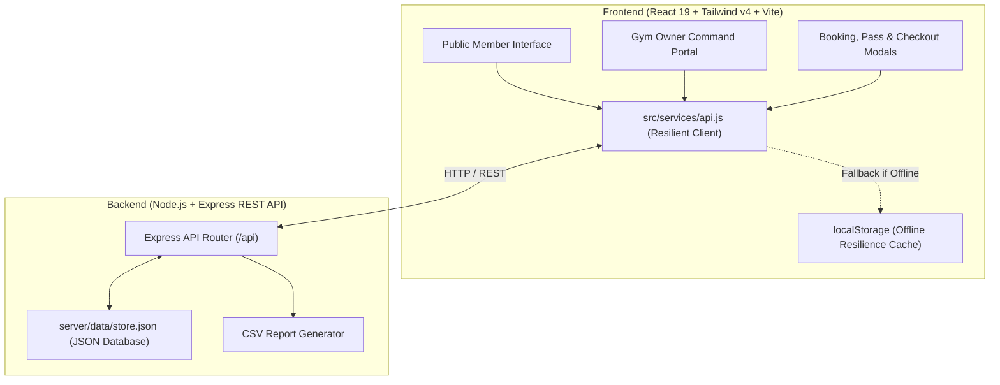

# 🏋️‍♂️ SFZ: Shehzad Fitness Zone — Enterprise Gym & Human Performance Platform

[](https://nodejs.org)
[](https://react.dev)
[](https://tailwindcss.com)
[](https://expressjs.com)
[](LICENSE)

> **Commercial-Grade, Full-Stack Gym Management & Client Acquisition Web Application**  
> Designed for **gym owners, personal training studios, and corporate portfolio demonstration**.

---

## 🌟 Executive Summary

**Shehzad Fitness Zone (SFZ)** elevates a simple gym landing page into a high-conversion, full-stack digital fitness ecosystem. It seamlessly bridges two essential worlds:

1. **The Member Experience**: A high-energy, dark-aesthetic portal with live booking, biometric calculators, transparent pricing, and instant digital VIP pass generation.
2. **The Gym Owner CRM & Command Center**: A backoffice portal empowering gym managers to monitor live floor capacity, follow up with leads via 1-click WhatsApp automation, punch member attendance, track Monthly Recurring Revenue (MRR), and export sales pipelines to CSV.

---

## ⚡ Core Capabilities & Real-World Use Cases

### 1. 🎯 Member & Client Acquisition Portal
* **High-Impact Athletic Hero**: Live status pill showing arena operational state, operating hours, real-time athlete count, and dual CTAs.
* **Filterable Training Disciplines**: Hypertrophy & Bodybuilding, Spartan CrossFit, Olympic Powerlifting (1RM Peaking), Metabolic HIIT, Combat Boxing, and Restorative Mobility.
* **Live Weekly Class Schedule**: Interactive timetable filterable by day (Mon–Sun) with live seat capacity bars (e.g. `17/20 spots booked`) and instant spot reservation modal.
* **SFZ Multi-Tool Fitness Lab**:
  * **Biometric BMI & Body Composition Engine**: Color-coded range gauge, ideal weight calculator, Deurenberg body fat % estimate, and coach's routine recommendations.
  * **TDEE & Daily Macro Planner**: Mifflin-St Jeor formula calculating exact calorie targets (Fat Loss, Maintenance, Clean Bulk) and grams of Protein, Carbs, and Fats.
  * **1-Rep Max (1RM) Peaking Benchmarks**: Brzycki formula estimator with complete working load percentage table (95% down to 70%).
* **Transparent Tiered Pricing**:
  * Monthly vs Annual toggle (with 25% discount logic).
  * Silver Starter (₹1,499/mo), Gold Pro Athlete (₹2,499/mo - Featured), and Diamond Elite VIP (₹4,499/mo).
  * Interactive checkout with promo coupon verification (`SFZFIRST`) and instant digital membership pass generation.
* **Verified Proof & Transformations**: Before & after showcase cards with verified weight/muscle metrics, trainer quotes, and Google 4.9★ reviews.
* **Integrated Lead Capture & Direct WhatsApp Concierge**: Instant routing of join requests and direct front-desk chat shortcuts.

---

### 2. 🛡️ Gym Owner & Staff Command Portal
* **Live KPI Dashboard**:
  * Total Active Members (482+) with 94.2% renewal rate.
  * Today's Check-ins counter with real-time floor capacity meter (e.g. 28/60 athletes).
  * Monthly Recurring Revenue (MRR) tracking with MoM growth velocity.
  * Lead-to-member conversion analytics.
* **Sales Pipeline & Lead CRM**:
  * Status tracking: `New`, `Trial Scheduled`, `Contacted`, `Enrolled`, `Lost`.
  * **One-Click WhatsApp Integration**: Pre-fills personalized client follow-up messages directly into WhatsApp Web/Mobile.
  * **1-Click Member Conversion**: Promotes prospective trial leads directly into enrolled members.
  * **CSV Data Export**: Single-click export of inquiries for marketing campaigns.
* **Member Directory & Front-Desk Attendance**:
  * Member ID lookup, assigned coach, and plan tier.
  * **"Punch In" Attendance Simulation**: Records check-ins, updates attendance streaks, and logs live facility entries.
* **Class Capacity Monitor**: Live tracking of bookings and roster occupancy across studio sessions.

---

## 🏗️ Architecture & Data Flow



---

## 📡 REST API Reference

| Method | Endpoint | Description |
| :--- | :--- | :--- |
| `GET` | `/api/health` | System health check and server timestamp |
| `GET` | `/api/stats` | Live KPIs (MRR, check-ins, occupancy, conversion) |
| `GET` | `/api/leads` | List leads (supports `?status=` and `?search=`) |
| `POST` | `/api/leads` | Submit trial pass or membership application |
| `PATCH`| `/api/leads/:id` | Update lead status (`contacted`, `enrolled`, etc.) |
| `DELETE`| `/api/leads/:id` | Archive / remove lead |
| `GET` | `/api/export/leads` | Export leads report as `.csv` download |
| `GET` | `/api/members` | Directory of enrolled gym members |
| `POST` | `/api/members` | Enroll new member manually |
| `POST` | `/api/members/:id/checkin` | Record member attendance check-in |
| `GET` | `/api/classes` | Weekly class timetable and seat capacity |
| `POST` | `/api/classes/:id/book` | Reserve spot in a class |
| `POST` | `/api/auth/register` | Create a member account |
| `POST` | `/api/auth/login` | Sign in as a member or configured owner |
| `GET` | `/api/auth/me` | Get the current authenticated account |
| `GET` | `/api/member/profile` | Get the signed-in member's profile, streak, and progress history |
| `PATCH` | `/api/member/profile` | Save the signed-in member's profile details |
| `POST` | `/api/member/progress` | Upload a daily progress photo and optional weight/note |
| `GET` | `/api/member/progress/:id/photo` | Retrieve one of the signed-in member's private photos |
| `GET` | `/api/owner/accounts` | Owner-only registered account and progress summary |
| `GET` | `/api/owner/accounts/:accountId/progress/:progressId/photo` | Owner-only retrieval of a member progress photo |
| `GET` | `/api/payments` | Owner-only recorded payment history |
| `PATCH` | `/api/leads/:id/payment` | Record a pending membership fee and activate the member |

Owner CRM endpoints require an authenticated owner session. Member registration always creates a member account; owner accounts are provisioned only through server environment variables.
Progress photos accept JPG, PNG, or WebP files up to 5 MB and are stored in `server/uploads/`, which is excluded from Git. A member can add one photo entry per UTC day; only their own authenticated account can retrieve those images.
Membership plan requests stay pending until the owner records payment. The owner portal's WhatsApp reminder opens a prefilled message for manual sending; it does not send messages automatically. This app does not process online payments.

---

## 🚀 Quickstart & Local Setup

### Prerequisites
* **Node.js** (v18 or higher recommended)
* **npm** (v9 or higher)

### 1. Clone & Navigate
```bash
cd sfz-fitness-platform
```

### 2. Install Dependencies
```bash
npm install
```

### 3. Run Development Environment
Create a local environment file and fill in the owner email, a strong owner password, and a long random signing secret. `.env` is ignored by Git.

PowerShell:
```powershell
Copy-Item .env.example .env
node -e "console.log(require('crypto').randomBytes(32).toString('hex'))"
# Paste the generated value into AUTH_SECRET in .env, and set OWNER_EMAIL and OWNER_PASSWORD there.
npm run dev:all
```

The owner account is unavailable until `OWNER_EMAIL` and `OWNER_PASSWORD` are set. Visitors can create member accounts from **Sign in** in the site navigation.

You can launch both the frontend and backend concurrently with one command:
```bash
npm run dev:all
```
* **Frontend**: `http://localhost:5173`
* **Express API Server**: `http://localhost:5000`

Or run them individually:
```bash
# Terminal 1: Backend Server
npm run server

# Terminal 2: React Frontend
npm run dev
```

### 4. Build for Production
```bash
npm run build
```
Creates an optimized production bundle inside `dist/`.

---

## 🌐 Production Deployment Options

1. **Vercel / Netlify**: Deploy the `dist/` directory directly for static hosting. The built-in resilient API client will automatically fall back to browser `localStorage`, ensuring 100% functionality even without a dedicated Node backend.
2. **Render / Railway / Fly.io**: Deploy as a unified full-stack Node.js app using `npm run build` and `npm start`.
3. **Docker**: Package the container with Node 20 alpine to run both static file serving and the Express API.

---

## 👨‍💻 Author & Credits

* **Developer & Founder**: **Mohd. Shehzad**
* **GitHub**: [@ShehzadChouhan](https://github.com/ShehzadChouhan)
* **Brand**: **Shehzad Fitness Zone (SFZ)**, Ludhiana, Punjab
* **Tagline**: *Unleash Your Highest Potential*
